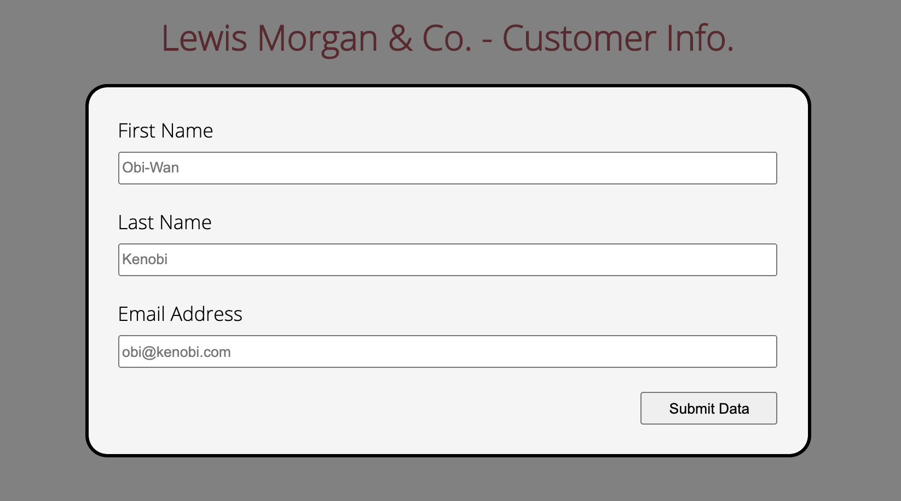

# ISM4300_HTML-Basics

Tasks:

- Add a Header with Title that would include Your Name along with "& Co. - Customer Information"
- Collect from the user as input: First Name, Last Name, and Email Address
- Add a Button labeled "Submit Data"
- Style your page with a .css file
- Submit your .html and .css files to a repository in GitHub called "HLML-Basics"

Asks the user for information about a customer. Includes placeholder text for input fields wrapped around a form. All fields are required to be entered.
The entirety of the site is styled using flex containers so it has consistent sizes across devices. It'll center onto the screen if it goes past a certain width.

---

